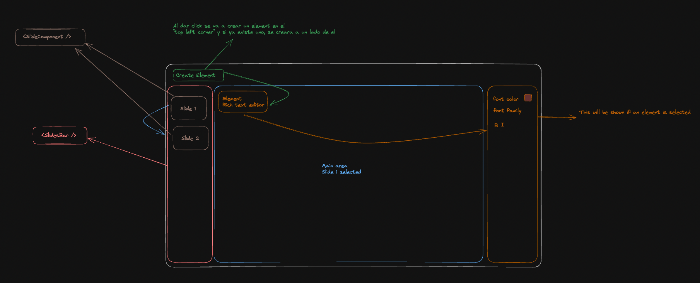

# Presentation app

**Description:** The project is a React application built with Next.js and Tailwind CSS that simulates a presentation app.

## Table of Contents

- [Task given](#task-given)
- [Thinking process](#thinking-process)
- [Tech/Libraries Used](#techlibraries-used)
- [Project Structure](#project-structure)
- [Installation](#installation)
- [Usage](#usage)
- [Possible Improvements](#possible-improvements)

## Task given

Create a React application where the main screen has a central area for adding new elements. To the left, there should be a menu with two buttons - each button should look like a miniature slide. By clicking on each we should be able to change the context like in the presentation app.

Above the area for adding elements, there should be a button for adding new elements. When this button is pressed, a new element should appear in the top left corner, or next to an existing element if one is already there - in the central area. The new element will be an instance of a rich text editor.

When we create elements on the first "slide" they should not appear on the second one.

When an instance is selected, a menu should appear on the right side for text manipulation: bold, italic, font color, and font family (minimum of 2 options).

When an instance of the rich text editor is selected, it should be focused (active), and the current styles should be reflected in the menu of the selected instance.

As you switch between instances, you should see changes in the menu of active styles.

It should be possible to change the slide (by pressing the buttons on the left) and load rich text editor instances that belongs to the currently selected slide.

## Thinking process

## Tech/Libraries Used

- Next.js
- Tailwind CSS
- TypeScript
- Context API for state management

## Project Structure

- `pages/index.tsx`: Main page component where the presentation app is rendered.
- `hooks/usePresentation.ts`: Custom hook for managing global state and slide manipulation.
- `reducers/presentationReducer.ts`: Reducer used to handle presentation state with useReducer hook.
- `components/`: Folder containing reusable components used in the app.

## Installation

1. Clone the repository.
2. Install dependencies using `npm install`.

## Usage

1. Run the app locally using `npm run dev`.
2. Access the app in your browser at `http://localhost:3000` (If port is already on use, please use the one given by NextJs on your shell).

## Possible Improvements

- Implement Storybook for component isolation and testing.
- Implement accessibility.
- Explore the use of isolated elements to prevent the re-rendering of the entire presentation when editing a single element.
- Enhance the design and user interface.
